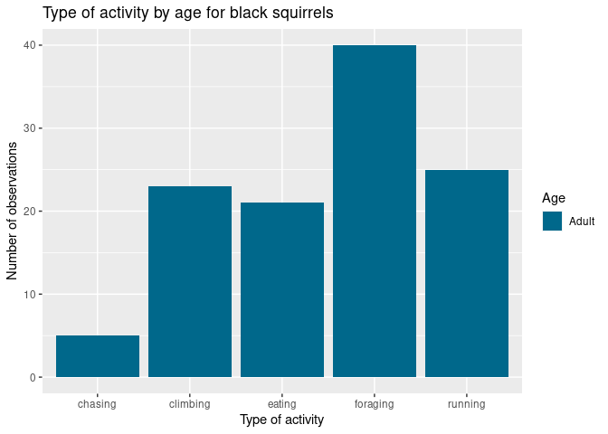

<!-- README.md is generated from README.Rmd. Please edit that file -->

# squirrels

<!-- badges: start -->
<!-- badges: end -->

The goal of squirrels is to …

## Installation

You can install the development version of squirrels from
[GitHub](https://github.com/) with:

``` r
# install.packages("devtools")
devtools::install_github("m-mburu/squirrels")
```

## Example

This is a basic example which shows you how to solve a common problem:

``` r
library(squirrels)
## basic example code
```

## Check Squirrel integrity

``` r
my_data_squirrels <- readr::read_csv(
  system.file("nyc_squirrels_sample.csv", package = "squirrels")
)
#> New names:
#> Rows: 400 Columns: 37
#> ── Column specification
#> ──────────────────────────────────────────────────────── Delimiter: "," chr
#> (14): unique_squirrel_id, hectare, shift, age, primary_fur_color, highli... dbl
#> (10): ...1, long, lat, date, hectare_squirrel_number, zip_codes, communi... lgl
#> (13): running, chasing, climbing, eating, foraging, kuks, quaas, moans, ...
#> ℹ Use `spec()` to retrieve the full column specification for this data. ℹ
#> Specify the column types or set `show_col_types = FALSE` to quiet this message.
#> • `` -> `...1`
check_squirrel_data_integrity(my_data_squirrels)
#> All primary fur colors are ok
```

# study_activity

``` r
data(nyc_squirrels_dummy)
study_activity(df_squirrels_act = nyc_squirrels_dummy, 
               col_primary_fur_color =  "Black")
#> $table
#> # A tibble: 5 × 4
#>   age   primary_fur_color activity counts
#>   <chr> <chr>             <chr>     <dbl>
#> 1 Adult Black             running      25
#> 2 Adult Black             chasing       5
#> 3 Adult Black             climbing     23
#> 4 Adult Black             eating       21
#> 5 Adult Black             foraging     40
#> 
#> $graph
```


